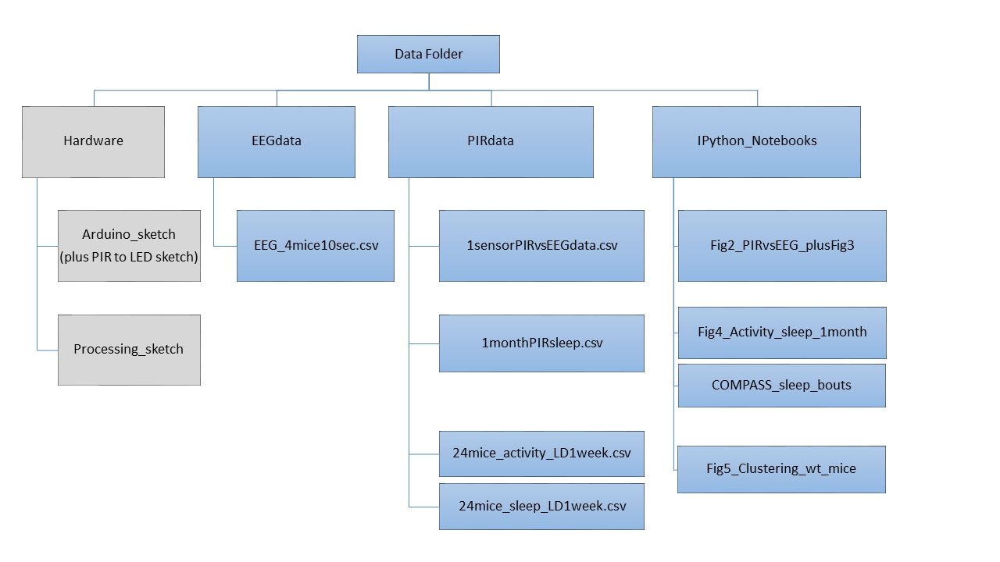

# COMPASS_paper
# Notebooks and files for Wellcome Open Research submission

### These notebooks provide examples of one method for processing timeseries data from the COMPASS system described in Brown et al (2016)

How to cite: Brown LA, Hasan S, Foster RG and Peirson SN. COMPASS: Continuous Open Mouse Phenotyping of Activity and Sleep Status [version 2; referees: 4 approved]. Wellcome Open Res 2017, 1:2 (doi: 10.12688/wellcomeopenres.9892.2)

####  https://wellcomeopenresearch.org/articles/1-2/v2
now including notebook for revised manuscript (v2) with one method for analysis of bouts of sleep


The analysis uses the Python programming language, version 2.7.11, as well a a number of more specific packages. These are all found as part of the Anaconda Python environment produced by Contiuum Analytics This is BSD licenced and cross platform. (https://www.continuum.io/downloads)

all required python packages:
  - pandas  0.18.0
  - numpy   1.10.4
  - matplotlib 1.5.1
  - seaborn   0.7.0

(environment can be recreated using 'conda create included COMPASS.yml file)

```
conda env create -f COMPASS.yml

```
and due to the amazing work of the binder.org team, the whole analysis can now be run in your browser:
https://mybinder.org/v2/gh/LozRiviera/COMPASS_paper/master




